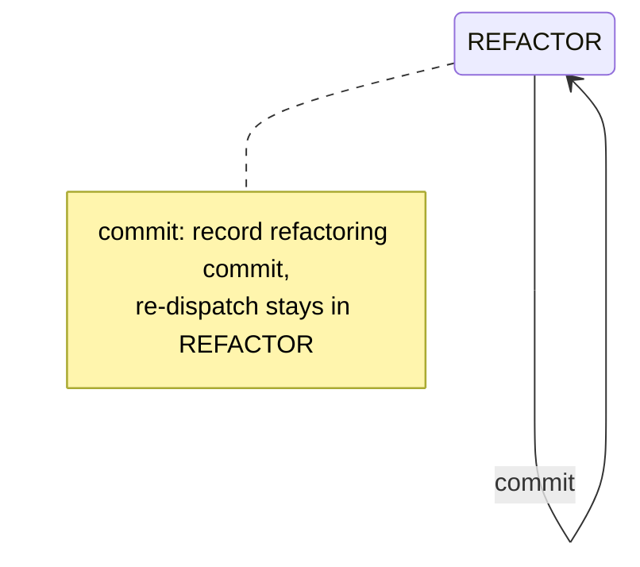

# Mermaid

Load this skill before authoring or reviewing Mermaid diagrams in any doc type (plans, retros, architecture docs, READMEs).

## Pitfalls

### Semicolons

Mermaid uses `;` as a statement terminator.
A semicolon inside an arrow message, `Note over` block, or `stateDiagram-v2` transition label breaks rendering silently in vivify and GitHub, even though `mmdc` may accept it.

```text
WRONG:  A --> B : pop (depth > 0; return to parent layer)
RIGHT:  A --> B : pop (depth > 0 — return to parent layer)

WRONG:  Note over A,B: Step 1; Step 2
RIGHT:  Note over A,B: Step 1, then Step 2
```

### Angle-bracket tokens

Raw `<word>` tokens in arrow messages and participant aliases are HTML-parsed by the markdown processor before Mermaid sees them.
`mmdc` accepts them; vivify and GitHub do not.

```text
WRONG:  participant <id>
RIGHT:  participant id

WRONG:  A --> B : <sessionID>-<slug>.md
RIGHT:  A --> B : sessionID-slug.md   (or use curly braces: {sessionID}-{slug}.md)

WRONG:  A --> B : send `payload` with > marker
RIGHT:  A --> B : send payload with → marker
```

### Quoted headings

`"## Heading"` inside a node label is rejected by some renderers.

```text
WRONG:  A["## Overview"]
RIGHT:  A["Overview"]
```

## Verify in a real renderer

Structural validators (`markdownlint-cli2`) check Markdown syntax but not Mermaid semantics.
`mmdc` catches most parser errors but not angle-bracket cases (the markdown pre-parse happens before Mermaid sees the input).
Both checks must pass before a diagram is considered done:

1. Run `mmdc -i <file>` (or pipe the fenced block) — catches semicolons and most syntax errors.
2. Confirm rendered output in vivify (`:MarkdownPreview`) or GitHub preview — catches angle-bracket cases that `mmdc` misses.

## State machines

When a state machine has a layer-stack or other dimension beyond the rendered states, accompany self-edges with a `note right of <state>` block to disambiguate the operation.



Without the note, a self-edge looks like the state doesn't change at all — the operation and its effect are invisible.
