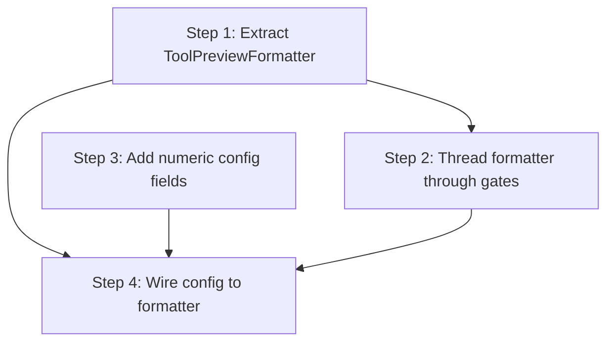

# Phase 1: Preview formatter extension seam

Goal: make issue [#266] (configurable preview limits + future formatter extension seam) easy to implement.

Today, `tool-input-preview.ts` uses module-level constants (`TOOL_INPUT_PREVIEW_MAX_LENGTH = 200`, `TOOL_TEXT_SUMMARY_MAX_LENGTH = 80`) and there is no path for extension config to reach the formatting layer.
The call chain from handler → gate descriptor → prompt → formatting spans 5 pure-function layers with no config parameter.
The config normalizer only handles booleans and arrays - no pattern exists for optional numeric fields.

## Current health metrics

| Metric               | Value                |
| -------------------- | -------------------- |
| Health score         | 74 B                 |
| LOC                  | 30,893               |
| Dead files / exports | 0%                   |
| Avg cyclomatic       | 1.4                  |
| p90 cyclomatic       | 2                    |
| Maintainability      | 91.2 (good)          |
| Duplication          | 9.3% (2,853 lines)   |
| Churn hotspots       | 41 files             |
| Refactoring targets  | 5 (4 medium, 1 high) |

## Findings

Filtered to what blocks or complicates [#266]:

| #   | Finding                                                                                                                                                                                                     | Category                           | Files                                                                                     | Impact | Risk | Priority |
| --- | ----------------------------------------------------------------------------------------------------------------------------------------------------------------------------------------------------------- | ---------------------------------- | ----------------------------------------------------------------------------------------- | ------ | ---- | -------- |
| 1   | `tool-input-preview.ts` is a flat bag of 15 exports (3 constants + 12 functions) mixing prompt formatting, log formatting, and text utilities - no cohesive object to receive config                        | B: oversized / C: coupling         | `tool-input-preview.ts`                                                                   | 5      | 2    | 20       |
| 2   | No config path to gate descriptors - `describeToolGate(tcc, check)` and `formatAskPrompt(result, agent, input)` are pure functions with no config parameter; adding one requires threading through 5 layers | C: parameter relay                 | `permission-gate-handler.ts`, `tool.ts`, `permission-prompts.ts`, `tool-input-preview.ts` | 4      | 2    | 16       |
| 3   | Config normalizer (`normalizePermissionSystemConfig`) has no pattern for optional numeric fields with defaults and bounds checking - only booleans and arrays                                               | C: coupling (missing abstraction)  | `extension-config.ts`                                                                     | 3      | 1    | 15       |
| 4   | `formatToolInputForPrompt` switch statement is the natural home for the future formatter extension seam but is buried in a utility module with no object to hang a `register()` method on                   | C: coupling (missing collaborator) | `tool-input-preview.ts`                                                                   | 4      | 2    | 16       |
| 5   | `permission-prompts.ts` test mocks `tool-input-preview` at module level - extracting a formatter object would let the test inject it directly, removing the `vi.mock()`                                     | D: testability                     | `permission-prompts.test.ts`                                                              | 2      | 1    | 10       |

## Steps

1. ✅ **Extract `ToolPreviewFormatter` class from `tool-input-preview.ts`** ([#282])
   - Created `tool-preview-formatter.ts` with `ToolPreviewFormatter` class accepting `ToolPreviewFormatterOptions` in its constructor
   - Moved 7 config-dependent methods onto the class: `formatToolInputForPrompt`, `formatJsonInputForPrompt`, `formatSearchInputForPrompt`, `sanitizeInlineText`, `formatGenericToolInputForLog`, `getToolInputPreviewForLog`, `getPermissionLogContext`
   - `tool-input-preview.ts` retains 8 pure utilities + 3 default constants
   - Outcome: formatter is a single injectable object; [#266] passes config by constructing the formatter with user-configured limits

2. ✅ **Thread `ToolPreviewFormatter` through the gate descriptor chain** ([#282])
   - `describeToolGate(tcc, check, formatter)` - accepts the formatter as third parameter
   - `formatAskPrompt(result, agentName, input, formatter?)` - accepts an optional formatter
   - `PermissionGateHandler.handleToolCall` constructs the formatter with default constant values and passes it to the tool gate producer
   - `permission-prompts.test.ts` `vi.mock` removed - formatter is injected directly
   - Outcome: config reaches formatting with one parameter instead of threading through 5 layers

3. ✅ **Add numeric config normalization to `extension-config.ts`** ([#266])
   - Added `normalizeOptionalPositiveInt` helper (exported; validates positive integer)
   - Added `toolInputPreviewMaxLength` and `toolTextSummaryMaxLength` as optional fields to `PermissionSystemExtensionConfig`
   - Updated `normalizePermissionSystemConfig` to parse both fields (omit when invalid/absent)
   - Updated `permissions.schema.json` (`type: "integer"`, `minimum: 1`) and `config.example.json`
   - Outcome: config system handles numeric fields; fallback to 200/80 constants when fields are absent
   - Commit: `feat: add toolInputPreviewMaxLength and toolTextSummaryMaxLength config fields (#266)`

4. ✅ **Wire config to `ToolPreviewFormatter` construction** ([#266])
   - Added `resolveToolPreviewLimits(config)` to `tool-preview-formatter.ts` (narrow `Pick` param; applies `??` fallbacks to the three formatter options)
   - `PermissionGateHandler.handleToolCall` now constructs the formatter with `resolveToolPreviewLimits(this.session.config)`
   - `session.config` is read fresh on every tool call - config reloads take effect automatically
   - Outcome: user-configured limits take effect at runtime; [#266] is complete
   - Commit: `feat: use configured preview limits in permission prompts (#266)`

## Step dependency diagram

## Tracks

| Track                | Steps | Description                                                |
| -------------------- | ----- | ---------------------------------------------------------- |
| Formatter extraction | 1 → 2 | Extract the collaborator, thread it through the call chain |
| Config schema        | 3     | Add numeric fields to config (independent of extraction)   |
| Integration          | 4     | Wire config to formatter (depends on both tracks)          |

[#266]: https://github.com/gotgenes/pi-packages/issues/266
[#282]: https://github.com/gotgenes/pi-packages/issues/282
