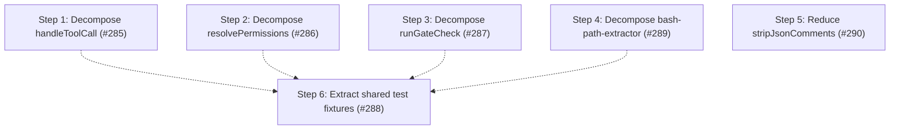

# Phase 2: Complexity and duplication paydown

Goal: pay down the complexity and duplication debt that `fallow` flags but no issue tracks.

Phase 1 is scoped to enabling [#266] (the preview formatter).
Phase 2 is a distinct theme: it eliminates the five `fallow` refactoring targets and drives down the test-tree duplication.
Four of the five targets sit on the security-critical `tool_call` decision path, where high untested complexity is a correctness risk, not only a maintainability one.

The two phases are otherwise independent and can run in either order, with one exception: do [#285] before Phase 1 step 2, since both modify the `describeToolGate` call site inside `handleToolCall`, and decomposing that function first lets the formatter thread through a clean pipeline.

## Current health metrics

| Metric               | Value                                                                                                  |
| -------------------- | ------------------------------------------------------------------------------------------------------ |
| Health score         | 74 B                                                                                                   |
| LOC                  | 31,416                                                                                                 |
| Dead files / exports | 0%                                                                                                     |
| Avg cyclomatic       | 1.4                                                                                                    |
| Maintainability      | 91.2 (good)                                                                                            |
| Duplication          | 9.2% (after [#286])                                                                                    |
| Refactoring targets  | 3 (2 medium, 1 high) - after [#290]; `config-loader.ts` no longer a target                             |
| Worst CRAP risk      | `permission-gate-handler.ts` 79.4 (handleInput) - after [#290]                                         |

## Findings

All findings are `fallow`-confirmed and untracked before this phase.

| #   | Finding                                                                                                                                                                                              | Category                         | Files                                   | Impact | Risk | Priority |
| --- | ---------------------------------------------------------------------------------------------------------------------------------------------------------------------------------------------------- | -------------------------------- | --------------------------------------- | ------ | ---- | -------- |
| 1   | `handleToolCall` runs six gates with a repeated bypass/runner/short-circuit shape - cognitive 52, CRAP 172, the package's worst                                                                      | B: god function                  | `handlers/permission-gate-handler.ts`   | 5      | 2    | 20       |
| 2   | ✅ `resolvePermissions` interleaves scope merge with parallel origin-map bookkeeping - cognitive 33, CRAP 97 - resolved by [#286]                                                                    | B: god function                  | `permission-manager.ts`                 | 4      | 2    | 16       |
| 3   | ✅ `runGateCheck` carried the full check→log→emit→approve cycle as six inline phases - cognitive 32 - resolved by [#287]                                                                             | B: god function                  | `handlers/gates/runner.ts`              | 4      | 2    | 16       |
| 4   | ✅ Two token classifiers share a 31-line rejection prelude (production clone); `collectPathCandidateTokens` (37) and `collectPatternCommandTokens` (33) are complexity hotspots - resolved by [#289] | A: duplication / B: god function | `handlers/gates/bash-path-extractor.ts` | 4      | 3    | 12       |
| 5   | ✅ `stripJsonComments` is a five-variable character scanner - cognitive 31 - resolved by [#290]                                                                                                      | B: god function                  | `config-loader.ts`                      | 2      | 2    | 8        |
| 6   | ✅ 9.1% duplication concentrated in the test tree - the single largest health deduction (-4.1) - resolved by [#288]                                                                                  | D: test duplication              | `test/` (clone families)                | 3      | 1    | 15       |

## Steps

1. ✅ **Decompose `handleToolCall`** ([#285]) - **completed**
   - Extracted `validateRequestedTool` (pure, exported) for the tool-name validation prelude.
   - Extracted `runGate` closure (inside `handleToolCall`) for the unified bypass/runner/short-circuit shape.
   - Collapsed the body to validate → build context → ordered producer-array pipeline.
   - Outcome: `handleToolCall` no longer appears as a refactoring target; CRAP risk for the file dropped from 172 → 79.4 (now `handleInput`); refactoring targets 5 → 4.

2. ✅ **Decompose `resolvePermissions`** ([#286]) - **completed**
   - Extracted `mergeScopesWithOrigins(scopes)` (into new `src/scope-merge.ts`) returning `{ mergedPermission, origins }`, isolating origin-map bookkeeping from the resolve pipeline.
   - The remaining body reads as load scopes → merge with origins → extract universal fallback → build config rules → compose.
   - Outcome: `resolvePermissions` no longer appears as a refactoring target; `permission-manager.ts` dropped from the CRAP-risk list.

3. ✅ **Thin `runGateCheck`** ([#287]) - **completed**
   - Introduced `SessionApproval` value object (`src/session-approval.ts`) owning the `{pattern}|{patterns}` union; exposed `representativePattern` and `toGateApproval()`.
   - `SessionRules.record(approval)` absorbs the per-pattern loop; `GateRunnerDeps` seam renamed to `recordSessionApproval(approval)` - runner tells the store, never interrogates the union.
   - Extracted `buildDecisionEvent` into `helpers.ts` to deduplicate the `origin/agentName/matchedPattern ?? null` normalization across both emit sites.
   - Outcome: `runner.ts` no longer appears as a refactoring target; refactoring targets 4 → 3.

4. ✅ **Decompose `bash-path-extractor.ts`** ([#289]) - **completed**
   - Extracted pure token classifiers into new `src/handlers/gates/bash-token-classification.ts`; private `rejectNonPathToken` predicate eliminates the 31-line rejection-prelude clone.
   - Extracted `classifyPatternCommandFlag` (returns a `PatternCommandFlagDirective` discriminated union) to replace the inline flag state machine in `collectPatternCommandTokens`.
   - Extracted `collectCommandTokens`, `collectGenericCommandTokens`, `collectRedirectTokens` from `collectPathCandidateTokens`; converted both walkers from output-argument accumulator to return-based `string[]`.
   - Category: A + B (production clone + god functions)
   - Outcome: clone removed; `collectPathCandidateTokens` and `collectPatternCommandTokens` decomposed into focused helpers; `bash-token-classification.ts` has dedicated unit tests (43 tests) covering every rejection and acceptance branch.

5. ✅ **Reduce `stripJsonComments` complexity** ([#290]) - **completed**
   - Replaced the five-flag single-loop scanner with a stateless dispatcher delegating to three private consume helpers: `consumeLineComment`, `consumeBlockComment`, and `consumeString`, each returning a `ScanSegment` value (`{ output, nextIndex }`).
   - Added 14 direct unit tests for `stripJsonComments` (the function was exported but had no dedicated coverage) to pin the contract before the refactor.
   - Category: B (god function)
   - Outcome: `stripJsonComments` no longer appears as a refactoring target; `config-loader.ts` dropped from the CRAP-risk list; refactoring targets 4 → 3.
   - Commits: `test: add direct stripJsonComments unit tests`, `refactor: model stripJsonComments as consume helpers`

6. ✅ **Extract shared test fixtures** ([#288]) - **completed**
   - Created `test/helpers/handler-fixtures.ts` (`makeCtx`, `makeEvents`, `makeSession`, `makeToolRegistry`, `makeToolCallEvent`, `makeCheckResult`, `makeHandler`, `getDecisionEvents`), `test/helpers/gate-fixtures.ts` (`makeDescriptor`, `makeRunnerDeps`, `makeTcc`, `makeGateCheckResult`), and `test/helpers/manager-harness.ts` (`createManager`).
   - Migrated handler-event clone family (`tool-call-events.test.ts`, `tool-call.test.ts`, `input-events.test.ts`, `input.test.ts`, `permission-session.test.ts`), external-directory family, gate family (`runner.test.ts`, `bash-path.test.ts`, `path.test.ts`), manager harness (`permission-system.test.ts`), and lifecycle setup (`before-agent-start.test.ts`, `lifecycle.test.ts`).
   - Category: D (test duplication)
   - Outcome: duplication 9.1% → 7.1%; clone groups 122 → 113; health deduction -4.1 → -2.1.

## Step dependency diagram

Steps 1-5 are independent.
Step 6 is best sequenced after the production refactors whose tested call sites it touches (dashed edges) - those refactors are behavior-preserving, so the soft ordering only avoids re-migrating fixtures, it does not block.

## Tracks

| Track                       | Steps   | Description                                                              |
| --------------------------- | ------- | ------------------------------------------------------------------------ |
| A: Decision-path complexity | 1, 2, 3 | Decompose the three `tool_call` hotspots (independent, parallel)         |
| B: bash-path-extractor      | 4       | Remove the production clone and reduce the two collect-function hotspots |
| C: config-loader            | 5       | Reduce `stripJsonComments` complexity (lowest priority)                  |
| D: Duplication              | 6       | Extract shared test fixtures; best sequenced after Tracks A and B        |

[#266]: https://github.com/gotgenes/pi-packages/issues/266
[#285]: https://github.com/gotgenes/pi-packages/issues/285
[#286]: https://github.com/gotgenes/pi-packages/issues/286
[#287]: https://github.com/gotgenes/pi-packages/issues/287
[#288]: https://github.com/gotgenes/pi-packages/issues/288
[#289]: https://github.com/gotgenes/pi-packages/issues/289
[#290]: https://github.com/gotgenes/pi-packages/issues/290
