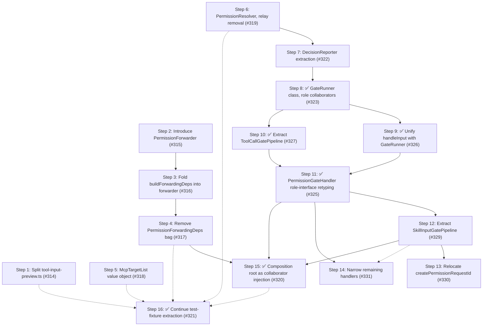

# Phase 3: State-owning collaborators

Goal: convert the package's remaining bags-of-state-and-closures into class-based collaborators that own their state and expose behavior (Tell-Don't-Ask), then clear the one outstanding `fallow` cohesion target and the test-tree duplication.

Phases 1 and 2 already gave the core domain good collaborators - `PermissionSession`, `ForwardingManager`, `SessionRules`, `SessionApproval`, `BashProgram`, `PermissionManager`.
Phase 3 finishes that arc where it stalled: the forwarding subsystem got a lifecycle class (`ForwardingManager`) but its behavior still lives as free functions reaching into a `PermissionForwardingDeps` bag that is assembled in two places.
The lens for this phase is not "extract a function" but "which stateful owner is missing, such that a caller reaches into a bag instead of telling an object?".

Phase 3 is independent of any open feature issue - it is a pure debt-reduction round.

## Current health metrics

| Metric                 | Value                                             |
| ---------------------- | ------------------------------------------------- |
| Health score           | 75 B                                              |
| LOC                    | 35,515                                            |
| Dead files / exports   | 0%                                                |
| Avg cyclomatic         | 1.4                                               |
| p90 cyclomatic         | 2                                                 |
| Maintainability        | 91.3 (good)                                       |
| Duplication            | 7.6% (2,700 lines, all in `test/`)                |
| Churn hotspots         | 41 files                                          |
| Refactoring targets    | 0                                                 |
| Dominant churn hotspot | `index.ts` 45.5 (accelerating) - 4× the next file |

Measurement note: `bash-token-classification.ts` reports the highest src CRAP (37.1, one function above threshold), but this is an artifact - `rejectNonPathToken` is a private helper, so `fallow` estimates 0% coverage and inflates its CRAP even though the module carries 43 dedicated unit tests.
It is not a real finding and gets no step.

## Findings

The headline findings are coupling smells (Category C) - anemic behavior, mutable closure state, and relay-only dependency bags - that `fallow`'s complexity metrics under-weight but the composition-root and forwarding code make obvious.

| #   | Finding                                                                                                                                                                                                                                                                                                                                                                                                                                                                                                                                                                                                                                                                   | Category                                            | Files                                                                    | Impact | Risk | Priority |
| --- | ------------------------------------------------------------------------------------------------------------------------------------------------------------------------------------------------------------------------------------------------------------------------------------------------------------------------------------------------------------------------------------------------------------------------------------------------------------------------------------------------------------------------------------------------------------------------------------------------------------------------------------------------------------------------- | --------------------------------------------------- | ------------------------------------------------------------------------ | ------ | ---- | -------- |
| 1   | Anemic forwarding subsystem: the forwarding lifecycle has a class (`ForwardingManager`) but its behavior is three free functions (`confirmPermission`, `waitForForwardedPermissionApproval` 132 lines, `processForwardedPermissionRequests` 144 lines) that reach into a `PermissionForwardingDeps` bag (8 members). The bag is assembled in `index.ts` and re-synthesized in `PermissionPrompter.buildForwardingDeps()` with divergent values and a cluster of `eslint-disable unbound-method` lines                                                                                                                                                                     | C: anemic / mutable closure state / relay-only deps | `forwarded-permissions/polling.ts`, `permission-prompter.ts`, `index.ts` | 5      | 3    | 15       |
| 2   | ✅ Resolved ([#314]) - `tool-input-preview.ts` was a flat bag of 8 functions mixing prompt formatting (`format{Edit,Write,Read}InputForPrompt`, `getPromptPath`), text utilities (`truncateInlineText`, `countTextLines`, `formatCount`), and serialization (`serializeToolInputPreview`) - density 0.33, 6 dependents; `fallow`'s only refactoring target. Prompt formatters split into `tool-input-prompt-formatters.ts`; `tool-input-preview.ts` is no longer a refactoring target.                                                                                                                                                                                    | B: oversized / E: cohesion                          | `tool-input-preview.ts`                                                  | 4      | 2    | 16       |
| 3   | 7.6% duplication, entirely in the test tree, is the largest single health deduction; the biggest clone families are `external-directory-integration.test.ts` (17 groups, 164 lines), `bash-path.test.ts` (9 groups, 120 lines), `runner.test.ts` (9 groups, 105 lines), and `tool-call.test.ts` (6 groups, 108 lines)                                                                                                                                                                                                                                                                                                                                                     | D: test duplication                                 | `test/` (clone families)                                                 | 3      | 1    | 15       |
| 4   | ✅ Resolved ([#318]) - `createMcpPermissionTargets` accumulated candidates through a `pushTarget` closure that mutated a local array and deduped via `includes` - every push site asked the array what it already held, then acted (Tell-Don't-Ask); mutable closure state with no owner. Replaced by the `McpTargetList` value object: `add` owns the null guard + dedup, `toArray` returns the ordered result; the per-mode branches now tell the list.                                                                                                                                                                                                                 | C: mutable closure state                            | `mcp-targets.ts`                                                         | 3      | 2    | 12       |
| 5   | ✅ Resolved ([#320]) — `piPermissionSystemExtension` was a 206-line composition root (149 at original analysis, grown since). The two genuinely anemic constructs — the inline `permissionsService` literal and the `activateServiceForSession` + teardown closures — were promoted to `LocalPermissionsService` and `PermissionServiceLifecycle` (`ServiceLifecycle` interface). The established injection-bag construction (`PermissionSessionRuntimeDeps`, `PermissionPrompterDeps`, etc.) is legitimate wiring kept inline per the anti-procedure-splitting rule. `index.ts` now ~170 lines; the "< 100 lines" target was explicitly deferred as procedure-splitting. | C: adapter closure density / E: wiring overhead     | `index.ts`                                                               | 4      | 3    | 12       |
| 6   | ✅ `handleToolCall` hand-assembled a 7-member `GateRunnerDeps` closure bag. Investigation ([#319]) found it was really a relay (`checkPermission` + `getSessionRuleset`) plus four genuine roles (resolve, record, prompt, report). Decomposed into the relay collapse (`PermissionResolver`, [#319] ✅), a `DecisionReporter` ([#322] ✅), a `GateRunner` class injected with role collaborators ([#323] ✅), and `PermissionGateHandler` role-interface retyping ([#325]); planning #325 surfaced two preparatory refactors that shrink the handler first — unifying `handleInput` with the runner ([#326]) and extracting a `ToolCallGatePipeline` ([#327])            | C: relay-only dependencies                          | `handlers/permission-gate-handler.ts`, `handlers/gates/descriptor.ts`    | 3      | 3    | 9        |

## Steps

1. ✅ **Split `tool-input-preview.ts` into cohesive modules** ([#314])
   - Target: `src/tool-input-preview.ts` (the sole `fallow` refactoring target).
   - Extracted the three prompt formatters plus `getPromptPath` into a new `src/tool-input-prompt-formatters.ts`; left the text utilities (`truncateInlineText`, `countTextLines`, `formatCount`), `serializeToolInputPreview`, and the three limit constants in `tool-input-preview.ts`.
   - Repointed the sole production consumer (`tool-preview-formatter.ts`) and relocated the moved functions' unit coverage into `test/tool-input-prompt-formatters.test.ts`; all four new exports are consumed, so `fallow` flags no dead re-export.
   - Smell category: B (oversized) / E (cohesion).
   - Outcome: `tool-input-preview.ts` dropped off the refactoring-target list; refactoring targets 1 → 0 (confirmed by `fallow health --targets`).

2. ✅ **Introduce a `PermissionForwarder` collaborator (own the state)** ([#315])
   - Target: new `src/forwarded-permissions/permission-forwarder.ts`; `forwarding-manager.ts`; `index.ts`.
   - Added a `PermissionForwarder` class exposing `requestApproval(ctx, message, options?, forwarded?)` and `processInbox(ctx)`; for this lift-and-shift step it holds the `PermissionForwardingDeps` bag privately (`shouldAutoApprove` supplied once at construction) and delegates to the existing `polling.ts` free functions, so behavior is unchanged.
   - Wired `ForwardingManager` to a narrow `InboxProcessor` seam (the manager only calls `processInbox`, mirroring the existing `ForwardingController` convention and dropping the test's `as unknown as` cast); constructed the single forwarder in `index.ts` and injected it.
   - Smell category: C (anemic domain model - give the forwarding behavior an owner).
   - Outcome: one forwarder instance replaces the threaded `index.ts` forwarding bag; `ForwardingManager` tells the forwarder instead of threading a deps bag.
     The bag interface itself is dismantled in [#317].

3. ✅ **Fold `PermissionPrompter.buildForwardingDeps()` into the injected forwarder** ([#316])
   - Target: `src/permission-prompter.ts`; `src/forwarded-permissions/permission-forwarder.ts`; `index.ts`.
   - Added the `ApprovalRequester` narrow seam (alongside `InboxProcessor`) to `permission-forwarder.ts`; narrowed `PermissionPrompterDeps` from 7 fields to 4 (removing `subagentSessionsDir`, `forwardingDir`, `registry`, `requestPermissionDecisionFromUi`); replaced the `confirmPermission(..., this.buildForwardingDeps(), ...)` call with `this.deps.forwarder.requestApproval(...)` and deleted `buildForwardingDeps()` and its `eslint-disable unbound-method` cluster; reordered `index.ts` to construct the single forwarder before the prompter and inject it.
   - Smell category: C (relay-only deps / duplicated bag construction).
   - Outcome: the forwarding dependency set is constructed exactly once; the prompter depends on a one-method interface instead of re-deriving a bag; `PermissionForwardingDeps` bag is dismantled in [#317].

4. ✅ **Remove `PermissionForwardingDeps`; inline the polling logic as forwarder methods** ([#317])
   - Target: `src/forwarded-permissions/polling.ts` → `permission-forwarder.ts` (sequence after Steps 2-3).
   - Added `PermissionForwarderDeps` (replaces `PermissionForwardingDeps`); dissolved the bag into individual `private readonly` fields on `PermissionForwarder`; inlined `waitForForwardedPermissionApproval` and `processForwardedPermissionRequests` as private methods reading `this`; extracted `buildForwardedRequest` (returns a value object), `pollForForwardedResponse` (owns the deadline loop + file cleanup), and `processSingleForwardedRequest` (per-request workflow) as focused private helpers; moved `getSessionId`, `getContextSystemPrompt`, `formatForwardedPermissionPrompt` to module-private functions (no external callers); deleted `polling.ts`; updated `index.ts` to import `PermissionForwarderDeps` from `permission-forwarder`; rewrote `permission-forwarder.test.ts` with real behavior tests (migrated from `permission-forwarding.test.ts`); removed stale `vi.mock` for polling from `runtime.test.ts`.
   - Smell category: C + B (the two god functions decompose as a consequence of the state having an owner).
   - Outcome: the 144-line and 132-line free functions became focused methods; `PermissionForwardingDeps` is gone; the forwarding subsystem is fully class-based (Track B complete).

5. ✅ **Introduce an `McpTargetList` value object** ([#318])
   - Target: `src/mcp-targets.ts`.
   - Added an exported `McpTargetList` class: `add(value)` owns the null/empty guard and the `includes` dedup (first-insertion wins); `toArray()` returns an independent ordered copy.
     Rewrote `createMcpPermissionTargets`, `pushMcpToolPermissionTargets`, and `addDerivedMcpServerTargets` to construct an `McpTargetList` and call `targets.add(...)` - the per-mode branches tell the list instead of asking the array.
     `McpTargetList` is exported and covered by direct unit tests (invariant: ignores null/empty, dedups, preserves order, `toArray` returns an independent copy).
   - Smell category: C (mutable closure state → value object that owns its invariant).
   - Outcome: the `pushTarget` closure and the `includes`-ask are gone; the uniqueness invariant lives in one owner; the per-mode dispatch reads as a sequence of tells; 6 new focused unit tests document the invariant in isolation (Track C complete for the accumulator).

6. ✅ **Introduce `PermissionResolver`; remove the session-rule relay** ([#319])
   - Target: `src/permission-resolver.ts` (new); `src/permission-session.ts`; the four gate descriptor factories (`path.ts`, `bash-path.ts`, `bash-external-directory.ts`, `bash-command.ts`); `handlers/gates/{descriptor,runner}.ts`; `handlers/permission-gate-handler.ts`.
   - `getSessionRuleset` was a pure relay - at every call site (the runner and every `describe*` gate) it only fed the next `checkPermission`.
     Collapsed the pair into a single `PermissionResolver.resolve(surface, input, agentName)` that `PermissionSession` implements; migrated all gates and the runner bag off the `(checkPermission, getSessionRuleset)` pair.
     `GateRunnerDeps` now `extends PermissionResolver`.
   - The original single-`GateRunnerContext` framing was rejected: a session-implemented interface would just re-expose the session ("glomming state").
     The bag is a relay plus four roles, decomposed across this step and two follow-ups.
   - Smell category: C (relay-only dependencies).
   - Outcome: the relay is gone from every gate; `getSessionRuleset` no longer appears in the gate-facing surface.
     The remaining roles are extracted in follow-ups - see step 7 (`DecisionReporter`, [#322] ✅) and steps 8-9 (`GateRunner`, [#323]; role-interface retyping, [#325]).

7. ✅ **Extract `DecisionReporter`; remove the review-log and decision-event closures** ([#322])
   - Target: `src/decision-reporter.ts` (new); `src/handlers/gates/descriptor.ts`; `src/handlers/gates/runner.ts`; `src/handlers/permission-gate-handler.ts`; `test/helpers/gate-fixtures.ts`; `test/handlers/gates/runner.test.ts`.
   - `writeReviewLog` and `emitDecision` were built as per-`handleToolCall` closures - a Law-of-Demeter reach-through (`session.logger.review`) and a bus-wrapping closure - then threaded into `GateRunnerDeps` as two flat members.
     Both fired by the runner (session-hit path, decision emit, `applyPermissionGate` callback) and the bypass branch; the same reach-through appeared again in `handleInput`.
     Extracted into a `DecisionReporter` interface + `GateDecisionReporter` class (owns `SessionLogger` + event bus); built once in `PermissionGateHandler`'s constructor and shared by `handleToolCall` and `handleInput`.
     `GateRunnerDeps` now carries `reporter: DecisionReporter` (replacing the two inline members); the runner and bypass branch fire through it.
   - Smell category: C (LoD violation + relay-only closure).
   - Outcome: the `writeReviewLog`/`emitDecision` closures are gone; two `unbound-method` eslint-disables removed; the event bus has a clear owner (`GateDecisionReporter`); `GateDecisionReporter` is directly unit-testable in isolation.

8. ✅ **Replace `GateRunnerDeps` with an injected `GateRunner` class** ([#323]) — **completed**
   - Target: `src/gate-prompter.ts` (new); `src/session-approval-recorder.ts` (new); `src/permission-session.ts`; `src/handlers/gates/runner.ts`; `src/handlers/gates/descriptor.ts`; `src/handlers/permission-gate-handler.ts`; `test/helpers/gate-fixtures.ts`; `test/handlers/gates/runner.test.ts`.
   - Added `GatePrompter` (`canConfirm()` + `promptPermission(details)`) and `SessionApprovalRecorder` role interfaces; `PermissionSession` implements both via stored-context adapters.
     `GateRunner` is constructed with `PermissionResolver`, `SessionApprovalRecorder`, `GatePrompter`, `DecisionReporter` and exposes `run(gate, agentName, toolCallId)` — absorbing the null/bypass/descriptor dispatch that previously lived in the handler's anonymous `runGate` closure.
     `PermissionGateHandler` constructs one `GateRunner` in its constructor and calls `runner.run(...)` per gate; the `runnerDeps` bag, the four collaborator closures, and the `runGate` closure are deleted.
   - Smell category: C (the bag's stable collaborators belong on a class, not threaded through a function).
   - Outcome: `GateRunnerDeps` is deleted; `runGateCheck` is deleted; the runner is a proper collaborator the handler constructs once and reuses; `makeRunnerDeps` replaced by `makeGateRunner({ runner, deps })` in `gate-fixtures.ts`.

9. **Unify `handleInput`'s skill-input gate with the `GateRunner` pipeline** ([#326])
   - Target: `src/handlers/permission-gate-handler.ts`; new `src/handlers/gates/skill-input.ts`; `src/denial-messages.ts`; `test/handlers/input*.test.ts`.
   - `handleInput` hand-rolls the `check → log → emit → approve` cycle that `GateRunner.runDescriptor` owns, with a nested eslint-disabled resolution ternary that duplicates `deriveResolution()` and direct reaches into `emitDecision` / `writeReviewLog` / `prompt` / `canPrompt` — the file's worst-CRAP function (79.4).
     Extract a `describeSkillInputGate(tcc, ...)` pure descriptor factory (mirroring `describeSkillReadGate`; `preCheck` preserving the raw `checkPermission` semantics), add a `skill_input` `DenialContext` kind, and run the descriptor through the shared `runner.run(...)`.
   - Deliberate change to settle in review: the skill-input deny messages gain the `[pi-permission-system]` tag (every other surface already carries it).
   - Smell category: A (duplication) / C (LoD reach-through).
   - Outcome: the inline gate, the nested ternary, and the direct reporter/prompter reaches are gone; `handleInput` becomes activate → resolveAgentName → describe → run; the handler's residual `PermissionSession` surface shrinks ahead of Step 11 ([#325]).

10. ✅ **Extract a `ToolCallGatePipeline` collaborator** ([#327])
    - Target: new `src/handlers/gates/tool-call-gate-pipeline.ts`; `src/handlers/permission-gate-handler.ts`; `src/permission-session.ts`; `src/index.ts`.
    - `handleToolCall` assembled six gate producers by reaching for anemic session getters (`getActiveSkillEntries`, `getInfrastructureDirs` + `getInfrastructureReadPaths`, `config`) — gate-construction work with no owner.
      Introduced `ToolCallGatePipeline` (constructed once in `index.ts`, injected into `PermissionGateHandler`) that owns bash-command extraction, the single `BashProgram.parse`, `ToolPreviewFormatter` construction, all six gate producers, and the run loop; `evaluate(tcc, runner)` returns the first block or allow.
      Applied Tell-Don't-Ask narrowings: `getInfrastructureReadDirs()` replaces the two-method reach + handler concat; `getToolPreviewLimits()` replaces `resolveToolPreviewLimits(session.config)`.
      Removed now-unused `getInfrastructureDirs()` / `getInfrastructureReadPaths()` from `PermissionSession`.
    - Smell category: C (anemic getters / missing collaborator).
    - Outcome: gate construction has an owner the handler tells; `handleToolCall` shrinks to activate → validate → build `tcc` → pipeline.evaluate → map outcome; the handler's residual `PermissionSession` surface ahead of Step 11 ([#325]) is `activate` + `resolveAgentName` plus the skill-input path's `checkPermission` + `createPermissionRequestId`.

11. ✅ **Retype `PermissionGateHandler` against narrow role interfaces** ([#325])
    - Target: new `src/gate-handler-session.ts`; `src/permission-session.ts`; `src/handlers/permission-gate-handler.ts`; `src/index.ts`; `test/helpers/handler-fixtures.ts`; `test/handlers/external-directory-integration.test.ts`; `test/handlers/external-directory-session-dedup.test.ts`.
    - The handler's constructor takes `session: PermissionSession` (concrete class, 36 public members); the `as unknown as PermissionSession` casts in every test mock disable TypeScript's structural check — the regression that prompted this (a mock missing `resolve()`) broke at runtime in [#319], not at `pnpm run check`.
      After Steps 9-10 ([#326], [#327]) the handler's residual session surface is four methods — `activate`, `resolveAgentName`, `checkPermission`, `createPermissionRequestId` — plus the `session.logger` read and the three roles passed to `GateRunner`.
      Introduced `GateHandlerSession` (those four methods, top-level `src/`, implemented by `PermissionSession`); injected the pre-built `GateRunner` (build `GateDecisionReporter` + `GateRunner` in `index.ts`) so the handler stops constructing collaborators and reaching `session.logger`, and dropped the `events` constructor param; retyped the three `makeSession` fixtures to the `MockGateHandlerSession` intersection using `vi.fn<T>()` and dropped the casts.
    - Planning surfaced three follow-ups that finish the arc: extract a `SkillInputGatePipeline` ([#329], which shrinks `GateHandlerSession` to a two-method context role), relocate `createPermissionRequestId` onto the request-creation collaborator ([#330]), and narrow `AgentPrepHandler` + `SessionLifecycleHandler` the same way ([#331]).
    - Smell category: C (concrete class dependency forces wide mocks; narrow interfaces enforce completeness at the type level).
    - Outcome: `as unknown as PermissionSession` casts are gone from the gate-handler mocks; the runner is injected, not built in the handler; a consumer calling a method the mock lacks fails at `pnpm run check`, not at runtime.

12. **✅ Extract a `SkillInputGatePipeline` collaborator** ([#329])
    - Target: new `src/handlers/gates/skill-input-gate-pipeline.ts`; `src/handlers/permission-gate-handler.ts`; `src/index.ts`; `test/handlers/input*.test.ts`.
    - `handleInput` hand-assembled the skill-input gate (raw `checkPermission` pre-check, deny notify, `describeSkillInputGate`, request-id mint, `runner.run`) — gate-construction work with no owner, asymmetric with the `tool_call` path's `ToolCallGatePipeline` ([#327]).
      Extracted `SkillInputGatePipeline` (constructed in `index.ts`, injected into `PermissionGateHandler`); reduced `handleInput` to activate → resolveAgentName → extract skill name → pipeline.evaluate → map outcome.
    - Smell category: C (missing collaborator).
    - Outcome: the `input` and `tool_call` paths are symmetric; `checkPermission` + `createPermissionRequestId` left the handler's session surface; `GateHandlerSession` collapsed to a two-method context role (`activate` + `resolveAgentName`).

13. **✅ Relocate `createPermissionRequestId` onto the request-creation collaborator** ([#330]) — folded into Step 12.
    - `createPermissionRequestId` moved into `SkillInputGatePipeline` as the module-level `createSkillInputRequestId()` helper; removed from `PermissionSession`.
    - Outcome: `PermissionSession` sheds a stateless utility; request-id creation lives next to request creation.

14. ✅ **Narrow `AgentPrepHandler` + `SessionLifecycleHandler` against role interfaces** ([#331])
    - Target: new `src/agent-prep-session.ts`; new `src/session-lifecycle-session.ts`; `src/gate-handler-session.ts`; `src/permission-session.ts`; `src/handlers/before-agent-start.ts`; `src/handlers/lifecycle.ts`; `test/handlers/before-agent-start.test.ts`; `test/handlers/lifecycle.test.ts`.
    - Both handlers took `session: PermissionSession` with `as unknown as PermissionSession` local mocks; the same structural smell [#325] removed from `PermissionGateHandler`.
      Introduced `AgentPrepSession` (extends `GateHandlerSession` + `SkillPermissionChecker`; adds 8 prep-specific methods) and `SessionLifecycleSession` (9-member role; intentionally omits `activate` — ISP); widened `GateHandlerSession.resolveAgentName` to accept an optional `systemPrompt` parameter so `AgentPrepHandler` reuses the shared context role without redefining it; `PermissionSession` adds both roles to its `implements` list with no method-body changes; retyped both local `makeSession` fixtures to the role with `vi.fn<T>()` per field and dropped the casts.
    - Smell category: C (concrete-class dependency forces wide mocks).
    - Outcome: no handler depends on the concrete `PermissionSession`; the last `as unknown as PermissionSession` casts in the handler test tree are gone; mock completeness is enforced at `pnpm run check` for all three handlers.

15. ✅ **Reframe the `index.ts` composition root as collaborator injection** ([#320])
    - Target: new `src/permissions-service.ts`; new `src/service-lifecycle.ts`; `src/handlers/lifecycle.ts`; `src/index.ts`.
    - Promoted the inline `permissionsService` literal to `LocalPermissionsService` (injected `PermissionManager` + `SessionRules` + `ToolInputFormatterRegistry`) and the `activateServiceForSession` + teardown closures to `PermissionServiceLifecycle` (implementing a narrow `ServiceLifecycle` interface); retyped `SessionLifecycleHandler` to take `ServiceLifecycle` instead of two raw callbacks.
    - The established injection-bag construction (`PermissionSessionRuntimeDeps`, `PermissionPrompterDeps`, `PermissionForwarderDeps`, command/RPC deps) was intentionally kept inline: relocating it into `buildX()` helpers would be pure statement relocation with no new collaborator — procedure-splitting per AGENTS.md.
    - Verified with `test/composition-root.test.ts`: handler registration, #302 child-gated service publish, and synchronous lifecycle subscription all unchanged.
    - Smell category: C (adapter closure density) / E (wiring overhead).
    - Outcome: `LocalPermissionsService` and `PermissionServiceLifecycle` provide testable homes for the two anemic inline constructs; `SessionLifecycleHandler` depends on a narrow two-method interface instead of raw callbacks; `index.ts` ~206 → ~170 lines.
      The "< 100 lines" target was explicitly deferred as procedure-splitting.

16. ✅ **Continue shared test-fixture extraction** ([#321]) — **completed**
    - Target: the four largest remaining clone families - `external-directory-integration.test.ts`, `bash-path.test.ts`, `runner.test.ts`, `tool-call.test.ts`.
    - Migrated all four families onto the existing `test/helpers/` fixtures; extended `gate-fixtures.ts` with `resolveResult` option on `makeGateRunner`, `makeDenialDescriptor`, and `makePathDispatchResolver`; extended `handler-fixtures.ts` with `makeSurfaceCheck`, `makeBashCommandCheck`, and the `tools` shortcut on `makeHandler`.
    - Smell category: D (test duplication).
    - Outcome: duplication 7.6% → 6.6%; clone groups 133 → 122.
      The <6% target was not fully reached; `external-directory-session-dedup.test.ts` carries a residual local-`makeSession` clone family that is outside the four-file scope — a follow-up issue will address it.

## Step dependency diagram

The forwarding collaborator is a lift-and-shift sequence: Step 2 introduces the class, Step 3 removes the duplicated bag, Step 4 inlines the logic and deletes the interface (introduce-new-alongside-old, remove-old-last).
The gate-runner rework is a sequential extraction chain: Steps 6-8 are done; Steps 9-11 unify the input gate, extract the gate pipeline, and retype the handler against narrow interfaces, then Steps 12-14 are the [#325] follow-ups that finish the arc — each shrinks the handler's session surface before the next.
Step 12 (`SkillInputGatePipeline`) depends on Step 11 and shrinks `GateHandlerSession` to a two-method context role; Step 13 relocates the request-id minter onto that pipeline; Step 14 narrows the remaining two handlers, reusing the context role (soft edge).
Step 15 (composition root) depends on the forwarding collaborator (Steps 2-4) and the full gate-runner/handler rework (Steps 6-14); it is sequenced after Step 12 so the `SkillInputGatePipeline` already exists to be injected, rather than re-touching `index.ts` after the reframe.
Step 16 is best sequenced after the production refactors whose tested call sites it touches (dashed edges) - those refactors are behavior-preserving, so the soft ordering only avoids re-migrating fixtures, it does not block.

## Tracks

| Track                      | Steps                             | Description                                                                                                                                                                                                                                                                                                                |
| -------------------------- | --------------------------------- | -------------------------------------------------------------------------------------------------------------------------------------------------------------------------------------------------------------------------------------------------------------------------------------------------------------------------- |
| A: Module cohesion         | 1                                 | Split the `tool-input-preview.ts` bag (independent)                                                                                                                                                                                                                                                                        |
| B: Forwarding collaborator | 2 → 3 → 4                         | Give the forwarding behavior a stateful owner; delete the duplicated bag (sequential lift-and-shift)                                                                                                                                                                                                                       |
| C: State encapsulation     | 5, 6, 7, 8, 9, 10, 11, 12, 13, 14 | `McpTargetList` value object, the gate-runner collaborator rework (`PermissionResolver` → `DecisionReporter` → `GateRunner` → `handleInput` unification → `ToolCallGatePipeline` → role-interface retyping), and the #325 follow-ups (`SkillInputGatePipeline` → request-id relocation → narrowing the remaining handlers) |
| D: Composition root        | 15                                | Reframe `index.ts` as collaborator injection (after Tracks B and C)                                                                                                                                                                                                                                                        |
| E: Test duplication        | 16                                | Migrate the four largest clone families onto shared fixtures (best last)                                                                                                                                                                                                                                                   |

[#314]: https://github.com/gotgenes/pi-packages/issues/314
[#315]: https://github.com/gotgenes/pi-packages/issues/315
[#316]: https://github.com/gotgenes/pi-packages/issues/316
[#317]: https://github.com/gotgenes/pi-packages/issues/317
[#318]: https://github.com/gotgenes/pi-packages/issues/318
[#319]: https://github.com/gotgenes/pi-packages/issues/319
[#320]: https://github.com/gotgenes/pi-packages/issues/320
[#321]: https://github.com/gotgenes/pi-packages/issues/321
[#322]: https://github.com/gotgenes/pi-packages/issues/322
[#323]: https://github.com/gotgenes/pi-packages/issues/323
[#325]: https://github.com/gotgenes/pi-packages/issues/325
[#326]: https://github.com/gotgenes/pi-packages/issues/326
[#327]: https://github.com/gotgenes/pi-packages/issues/327
[#329]: https://github.com/gotgenes/pi-packages/issues/329
[#330]: https://github.com/gotgenes/pi-packages/issues/330
[#331]: https://github.com/gotgenes/pi-packages/issues/331
